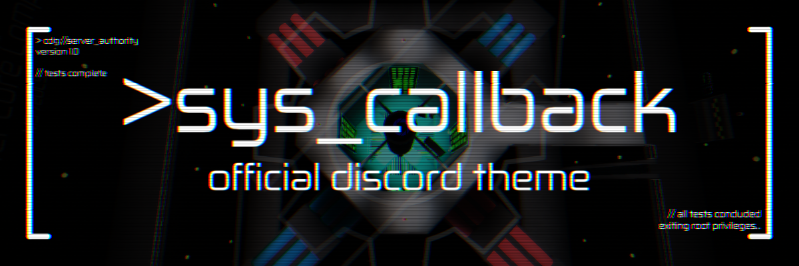
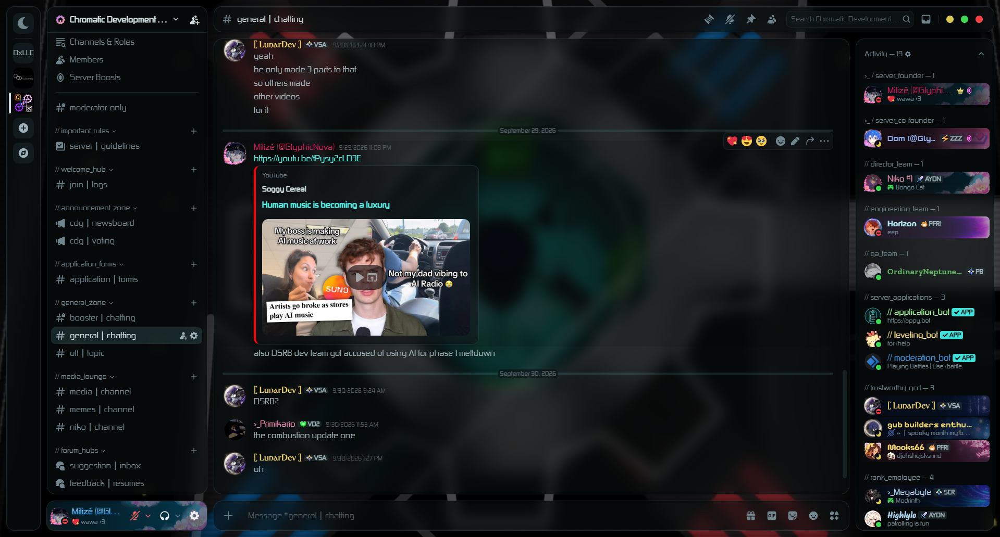
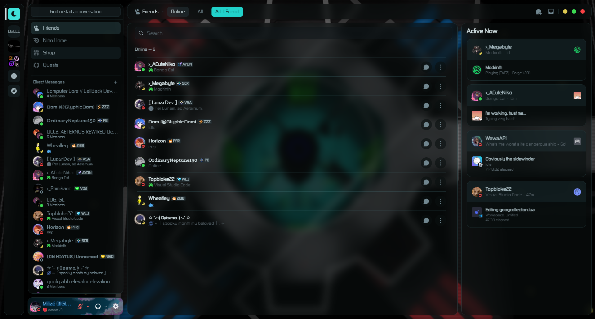
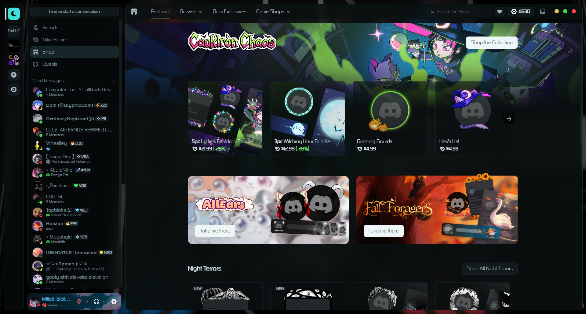
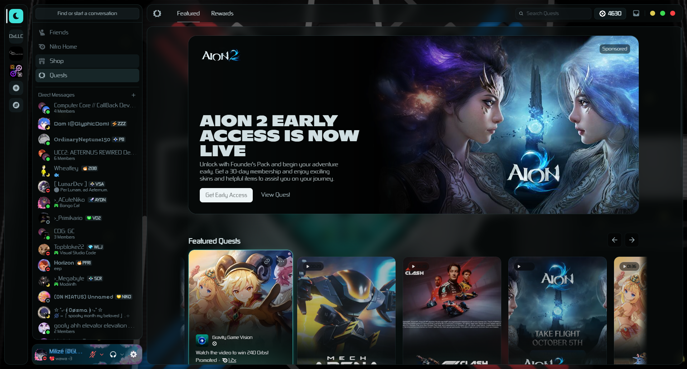

# > sys_callback (cdg_discord_theme)
Chromatic Development Group's dedicated BD/Vencord theme made specifically for an upcoming CDG project: Computer Core // CALLBACK.

Built on top of refact0r's midnight theme, it extends the base with a color palette pulled straight from the Computer Core's quantum frame chamber: a glowing cyan core, red and blue power conduits, green terminal readouts, and a near-black void.

## Table of Contents
- [Features](#features)
- [Design Philosophy](#design-philosophy)
- [Screenshots](#screenshots)
- [Installation](#installation)
  - [BetterDiscord](#betterdiscord)
  - [Vencord](#vencord)
- [Customisation](#customisation)
- [Contributing](#contributing)
- [License](#license)
- [Credits](#credits)

## Features
- A cyan accent for buttons, links, and highlights, taken from the glow of the core. <!-- if you keep orange: "A custom orange (#FF512D) for buttons and highlights." -->
- Status colors drawn from the scene: terminal green (online), conduit red (do not disturb), and star-speck yellow (idle).
- Optional blur on panels (toggle with `--panel-blur` and set `--blur-amount`, 12px by default).
- A separated chatbar (`--custom-chatbar: separated`) and a smaller user panel (`--small-user-panel: on`) to keep things tidy.
- Custom window controls and a titlebar-mounted inbox button for a cleaner top edge.
- Uses the Zekton font with Figtree as a fallback (you can change that too).
- Comes with CC//CALLBACK's quantum frame background image (you can swap it via `--background-image-url`).

## Design Philosophy
Everything here comes from the Computer Core reactor chamber: deep space-black panels with a faint teal tint, cool grey text, and cyan for the important bits, with red, blue, and green kept as functional colors so they still mean something. It's meant to feel like you're sitting at a ship's systems terminal, but without hurting your eyes. The theme uses `oklch` colors so they stay consistent across different screens, and you can turn the blur on or off depending on how much "glass" you want.

## Screenshots
### Main display

### Friends display

### Shop display

### Quests display

## Installation
### BetterDiscord
1. Download the `syscallback.theme.css` file from the [releases](../../releases) page (or clone the repo).
2. Open your BetterDiscord themes folder:
   - Windows: `%appdata%/BetterDiscord/themes`
   - macOS: `~/Library/Application Support/BetterDiscord/themes`
   - Linux: `~/.config/BetterDiscord/themes`
3. Move the theme file into that folder.
4. Enable the theme in Discord under **User Settings > BetterDiscord > Themes**.

### Vencord
1. Place the `syscallback-discord-theme.css` file into your Vencord themes directory (usually `~/.config/Vencord/themes` or the equivalent on your OS).
2. Enable it in Vencord's settings under **Themes**.

> **Note:** the theme loads midnight and the Zekton font from remote URLs, so you need an internet connection for it to render correctly.

## Customisation
You can tweak colors, fonts, and spacing by editing the CSS variables at the top of the theme file. The options live in the `body` block, and the colors live in the `:root` block. Notable variables to start with:
- `--accent-3`: the primary accent color used for buttons and highlights.
- `--panel-blur`: toggle the glass-morphism background blur on or off.
- `--blur-amount`: adjust the strength of the blur (default 12px).
- `--background-image-url`: swap the reactor background for your own image.
- `--custom-chatbar`: switch between default and separated chatbar layouts.
- `--font`: change the font (set it to `''` for Discord's default).
- `--top-bar-button-position`: choose where the inbox button sits (`titlebar`, `serverlist`, `hide`, or `off`).
- `--custom-window-controls`: switch between custom and default window controls.

Midnight's own options all still work, so refer to the [midnight documentation](https://github.com/refact0r/midnight-discord) for anything not listed here.

## Contributing
This is a personal hobby project, but if you spot a bug or have a suggestion, feel free to open an issue or submit a pull request. Keep in mind that the theme is tailored for CDG and Computer Core // CALLBACK, but general improvements are always welcome.

## License
This project is open-source and available under the **MIT License**. See the `LICENSE` file for details.

## Credits
* Theme by [GlyphicNova](https://discord.com/users/1407027034701434980) for the Chromatic Development Group.
* Base theme layout by [refact0r](https://github.com/refact0r/midnight-discord) (midnight).
* Zekton font via [CDNFonts](https://fonts.cdnfonts.com/css/zekton).
